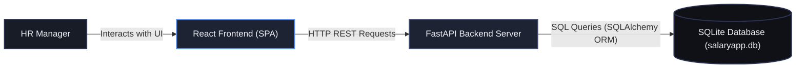

# System Architecture Diagram

Below is the high-level architecture diagram showing the relationship between the user, the frontend application, the backend API server, and the database storage layer.

---

