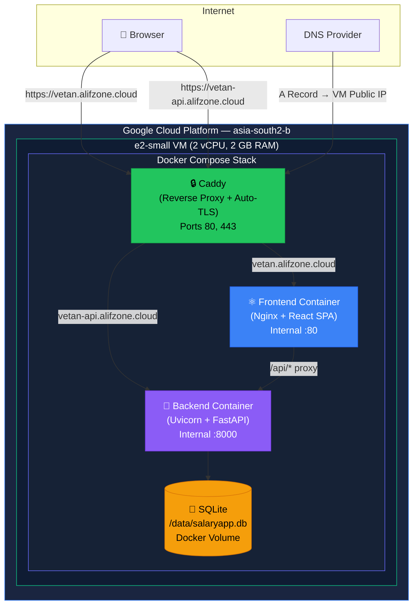
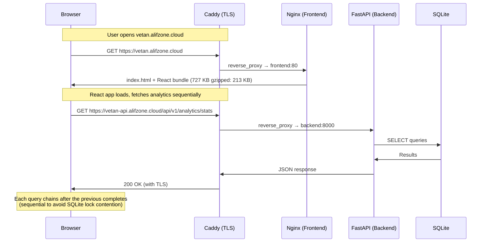
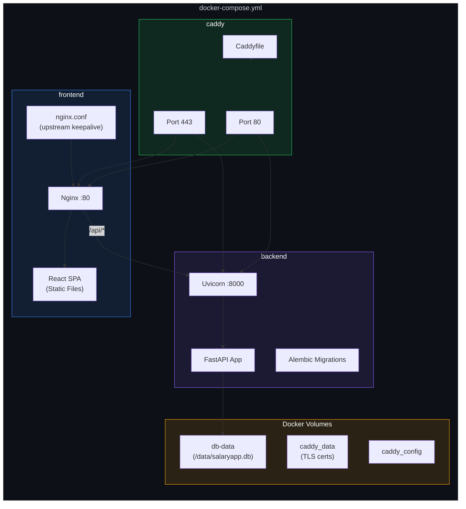
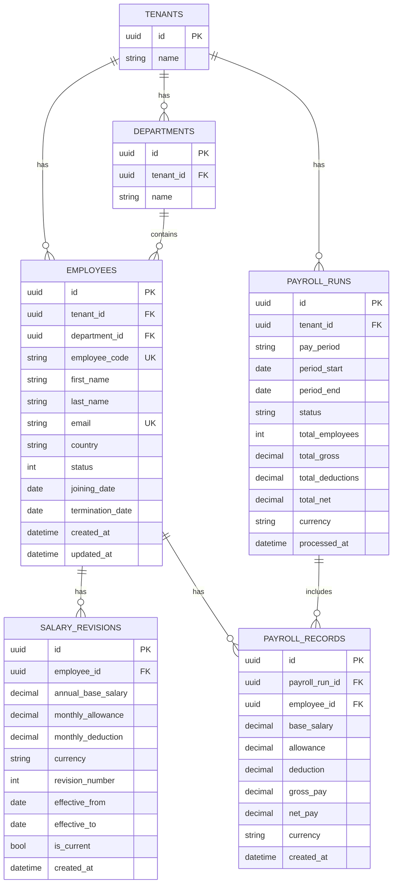

# Vetan — Architecture & Deployment

> **Vetan** (Hindi: वेतन, "salary") — A multi-tenant salary and payroll management system built for ACME Corp.

---

## 1. High-Level Architecture



---

## 2. Request Flow



---

## 3. Infrastructure Details

### GCP Compute

| Property | Value |
|---|---|
| **Machine Type** | `e2-small` (2 shared vCPU, 2 GB RAM) |
| **Zone** | `asia-south2-b` (Delhi, India) |
| **OS** | Linux (Debian/Ubuntu) |
| **Disk** | Default persistent disk |
| **Public IP** | Static (mapped to DNS A records) |

### DNS Configuration

| Record | Type | Value | Purpose |
|---|---|---|---|
| `vetan.alifzone.cloud` | A | `<VM Public IP>` | Frontend (React SPA) |
| `vetan-api.alifzone.cloud` | A | `<VM Public IP>` | Backend API (FastAPI) |

### TLS/SSL

Caddy automatically provisions and renews **Let's Encrypt** certificates for both subdomains. Zero configuration needed — Caddy handles ACME challenges, certificate storage, and HTTP→HTTPS redirects automatically.

---

## 4. Docker Container Architecture



### Container Specs

| Container | Base Image | Size | Exposes | Restart |
|---|---|---|---|---|
| `caddy` | `caddy:latest` | ~40 MB | `:80`, `:443` | `always` |
| `frontend` | `nginx:alpine` | ~25 MB | `:80` (internal) | `always` |
| `backend` | `python:3.11-slim` | ~220 MB | `:8000` (internal) | `always` |

### Docker Volumes

| Volume | Mount | Purpose |
|---|---|---|
| `db-data` | `/data/` in backend | SQLite database persistence across container restarts |
| `caddy_data` | `/data/` in caddy | TLS certificate storage |
| `caddy_config` | `/config/` in caddy | Caddy runtime configuration |

---

## 5. Application Architecture

### Backend (FastAPI)

```
main.py                    → FastAPI app entry, CORS, health check
├── routes/
│   ├── employees.py       → CRUD, search, pagination, CSV export
│   ├── salaries.py        → Salary revisions, compensation history
│   ├── payroll.py         → Payroll runs, processing, records
│   ├── analytics.py       → Dashboard aggregations (6 endpoints)
│   └── master.py          → Departments, countries lookup
├── models/
│   └── models.py          → SQLAlchemy ORM (5 tables)
├── schemas/               → Pydantic request/response schemas
├── clients/
│   └── database.py        → DB engine manager (SQLite/MySQL)
├── config/
│   └── db.py              → Database connection config from .env
├── migrations/            → Alembic migration scripts
└── seeds/                 → Sample data seeder (10K employees)
```

### Frontend (React + Vite)

```
app/
├── src/
│   ├── App.jsx            → Shell layout, routing, sidebar
│   ├── api.js             → Axios API client (all endpoints)
│   ├── utils.js           → Formatters, currency, colors
│   ├── index.css           → Complete design system
│   └── pages/
│       ├── dashboard/
│       │   └── DashboardPage.jsx    → Analytics charts & tables
│       └── employees/
│           ├── EmployeesPage.jsx    → Employee list, filters, export
│           ├── EmployeeDetail.jsx   → Profile, compensation, payroll
│           └── EmployeeModal.jsx    → Add/edit employee form
├── public/
│   └── favicon.svg         → Custom ₹ favicon
├── Dockerfile              → Multi-stage build (node → nginx)
└── nginx.conf              → Reverse proxy to backend + SPA routing
```

---

## 6. Data Model (ERD)



---

## 7. API Surface

### Employees (`/api/v1/employees`)

| Method | Endpoint | Description |
|---|---|---|
| `GET` | `/employees` | List with pagination, search, filters |
| `GET` | `/employees/{id}` | Single employee with current salary |
| `POST` | `/employees` | Create new employee |
| `PUT` | `/employees/{id}` | Update employee details |
| `DELETE` | `/employees/{id}` | Soft delete (set inactive) |
| `GET` | `/employees/export/csv` | Export filtered list as CSV |

### Salaries (`/api/v1/salaries`)

| Method | Endpoint | Description |
|---|---|---|
| `GET` | `/salaries/employee/{id}` | Salary revision history |
| `POST` | `/salaries` | Create salary revision |

### Payroll (`/api/v1/payroll`)

| Method | Endpoint | Description |
|---|---|---|
| `GET` | `/payroll/runs` | List payroll runs |
| `GET` | `/payroll/runs/{id}` | Run detail with records |
| `POST` | `/payroll/runs` | Create & process payroll run |

### Analytics (`/api/v1/analytics`)

| Method | Endpoint | Description |
|---|---|---|
| `GET` | `/analytics/stats` | Summary KPIs (headcount, avg salary, etc.) |
| `GET` | `/analytics/departments` | Department breakdown |
| `GET` | `/analytics/countries` | Country headcount |
| `GET` | `/analytics/salary-distribution` | Salary band distribution |
| `GET` | `/analytics/extreme-salaries` | Highest/lowest paid employees |
| `GET` | `/analytics/salary-audit` | Anomaly detection & audit trail |

### Master Data (`/api/v1`)

| Method | Endpoint | Description |
|---|---|---|
| `GET` | `/departments` | All departments |
| `GET` | `/countries` | All unique countries |

### Health (`/api/health`)

| Method | Endpoint | Description |
|---|---|---|
| `GET` | `/api/health` | Service + DB connectivity check |

---

## 8. Environment Variables

| Variable | Used By | Description |
|---|---|---|
| `DB_CONNECTION` | Backend | Database driver: `sqlite` or `mysql` |
| `DB_DATABASE` | Backend | Path to SQLite file (or MySQL DB name) |
| `DB_HOST` | Backend | MySQL host (if using MySQL) |
| `DB_PORT` | Backend | MySQL port (if using MySQL) |
| `DB_USERNAME` | Backend | MySQL credentials |
| `DB_PASSWORD` | Backend | MySQL credentials |
| `VITE_API_URL` | Frontend (build-time) | API base URL baked into JS bundle |
| `VITE_API_KEY` | Frontend (build-time) | API key for `x-api-key` header |
| `VITE_TENANT_NAME` | Frontend (build-time) | Display name in sidebar |

> [!WARNING]
> `VITE_*` variables are **inlined at build time** by Vite. Changing them requires a full `docker compose up --build`.

---

## 9. Deployment Runbook

### First-Time Setup

```bash
# 1. SSH into VM
gcloud compute ssh <instance-name> --zone=asia-south2-b

# 2. Install Docker & Docker Compose
sudo apt update && sudo apt install -y docker.io docker-compose-plugin
sudo usermod -aG docker $USER && newgrp docker

# 3. Clone the repository
git clone <repo-url> vetan && cd vetan

# 4. Configure environment
cp .env.example .env
# Edit .env with production values:
#   VITE_API_URL=https://vetan-api.alifzone.cloud/api/v1
#   VITE_API_KEY=<production-key>
#   VITE_TENANT_NAME=ACME

# 5. Deploy
docker compose up --build -d

# 6. Verify
docker compose ps
curl -k https://vetan-api.alifzone.cloud/api/health
```

### Updating

```bash
# Pull latest code
git pull origin main

# Rebuild and restart (zero-downtime for frontend)
docker compose up --build -d
```

### Database Backup

```bash
# Copy SQLite from Docker volume to host
docker cp vetan-backend-1:/data/salaryapp.db ./backup_$(date +%Y%m%d).db

# Or use volume mount path directly
sudo cp /var/lib/docker/volumes/vetan_db-data/_data/salaryapp.db ~/backups/
```

### Logs

```bash
# All containers
docker compose logs -f

# Specific container
docker compose logs -f backend
docker compose logs -f caddy
```

---

## 10. Performance Notes

| Optimization | Detail |
|---|---|
| **Sequential Analytics** | Dashboard fires 6 API calls **sequentially** (not in parallel) to avoid SQLite file-lock contention |
| **React Query Cache** | All analytics data is cached client-side; subsequent dashboard visits are instant |
| **Nginx Keepalive** | Frontend's Nginx maintains a pool of 16 persistent connections to the backend |
| **SQLite NullPool** | Each request gets a fresh connection — no pool contention in multi-threaded Uvicorn |
| **Caddy Auto-TLS** | Zero-config HTTPS with Let's Encrypt; HTTP/2 enabled by default |

---

## 11. Security Considerations

| Layer | Implementation |
|---|---|
| **TLS** | Caddy auto-provisions Let's Encrypt certs (A+ SSL rating) |
| **API Auth** | `x-api-key` header required on all API requests |
| **CORS** | Currently `allow_origins=["*"]` — restrict in production |
| **Database** | SQLite file inside Docker volume, not exposed externally |
| **Firewall** | GCP firewall rules: only ports 80/443 open |

> [!IMPORTANT]
> For production hardening, restrict CORS origins to `https://vetan.alifzone.cloud` and rotate the API key.

---

## 12. Cost Estimate

| Resource | Monthly Cost (approx.) |
|---|---|
| e2-small VM (2 vCPU, 2 GB) | ~$13/month |
| 10 GB persistent disk | ~$0.40/month |
| Static IP | Free (while attached to running VM) |
| Egress (< 1 GB/month) | Free tier |
| **Total** | **~$13.40/month** |
